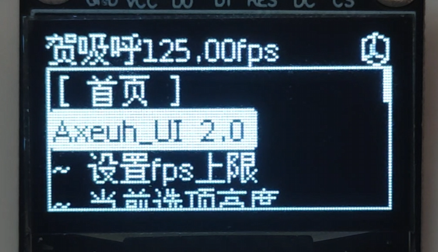

# Arduino 交互式UI系统

基于Arduino平台和Axeuh_UI库开发的综合界面系统，集成多级菜单、动态图形、3D渲染和硬件交互功能。基于U8G2库实现高性能显示驱动。

GIF或图片的转换在这里 https://javl.github.io/image2cpp/ 记得勾swap选项
(GIF需要先转换成一帧一帧的图片)



---

## 功能特性

### 核心功能
- **多级菜单系统**
  - 支持无限级菜单嵌套
  - 动态菜单项生成（`MenuOption`结构）
  - 图文混合显示（`PICTURE_TEXT`模式）
  - 菜单动画过渡效果（渐进动画函数）

- **图形渲染引擎**
  - 128x64 OLED显示驱动（U8G2集成）
  - GIF动画支持（`Menu_gif`结构）
  - 实时3D立方体渲染（`Axeuh_UI_Cube`类）

- **交互组件库**
  - 参数滑动调节条（`Axeuh_UI_slider`类）
  - 中文拼音输入键盘（`Axeuh_UI_Keyboard`类）
  - 状态栏组件（`Axeuh_UI_StatusBar`类）
  - 弹窗（`Axeuh_UI_Panel`类）

- **系统特性**
  - 异步UI刷新（`menu_display_xtaskbegin`）
  - 硬件中断优化（`xSemaphore`互斥锁）
  - 动态内存管理（`CharLenMap`字符缓存）
  - 低功耗模式支持

### 扩展功能
- 串口配置接口
- 拼音键盘
- 适配不同大小的屏幕
- 屏幕旋转支持（0°/90°/180°/270°）
- 适配不同字库（后续添加）

---

## 硬件要求

### 必需组件
| 组件               | 规格要求           | 推荐型号         | 接口说明       |
|--------------------|--------------------|------------------|----------------|
| 主控板             | 支持Arduino框架    | ESP32 DevKit     | -              |
| OLED显示屏         | 128x64分辨率       | SSD1306          | SPI/I2C        |
| 输入设备           | 5向导航+确认键     | 无       | ADC       |

### 推荐配置
- **处理器性能**
  - Flash存储：≥​​512KB（用于存储图形资源和字库）
  - SRAM：≥48KB
  - 时钟速度：≥72MHz（流畅动画）

---

## 快速开始

### 安装依赖

#### PlatformIO
```ini
lib_deps =
    https://github.com/Axeuh/Axeuh_UI_lib.git
```

#### Arduino IDE
1. 通过库管理器安装 `U8g2`
2. 下载[Axeuh_UI库ZIP](https://github.com/Axeuh/Axeuh_UI/archive/main.zip)
3. 菜单栏：项目 > 加载库 > 添加.ZIP库

### 硬件连接
```cpp
/* 典型接线示例 (ESP32) */
#define OLED_SDA  21  // I2C数据线
#define OLED_SCL  22  // I2C时钟线
#define ENC_A     34  // 摇杆x
#define ENC_B     35  // 摇杆y
#define ENC_SW    36  // 摇杆按键
```

### 基础配置
```cpp
#include <U8g2lib.h>
#include "Axeuh_UI.h"

// OLED 显示配置
U8G2_SSD1306_128X64_NONAME_F_HW_I2C u8g2(U8G2_R0);
Axeuh_UI myui(&u8g2);

// 简单的菜单选项
MenuOption helloOptions[] = {
    {"[ Hello UI ]", 14, ALIGN_CENTER, TEXT, nullptr, No_Trigger, nullptr, No_Focusing},
    {"欢迎使用Axeuh_UI", 14},
    {"这是一个简化示例", 14},
    {"按按键测试", 14}
};

// 创建文本菜单
Axeuh_UI_TextMenu helloMenu(helloOptions, sizeof(helloOptions) / sizeof(helloOptions[0]));

// 主面板
Axeuh_UI_Panel mainPanel;

// 简单的输入处理
IN_PUT_Mode simpleInput() {
    // 这里用模拟摇杆作为示例
    if (analogRead(35) < 100) return UP;
    if (analogRead(35) > 3995) return DOWN;
    if (analogRead(34) < 100) return LEFT;
    if (analogRead(34) > 3995) return RIGHT;
    if (!digitalRead(25)) return SELECT;
    
    return STOP;
}

void setup() {
    Serial.begin(115200);
    
    // 初始化按键引脚
    pinMode(35, INPUT);
    pinMode(34, INPUT);
    pinMode(25, INPUT_PULLUP);
    
    // 初始化UI系统
    myui.begin();
    myui.set(simpleInput);
    
    // 设置主面板
    mainPanel.set(&helloMenu);
    myui.set(&mainPanel);
    
    // 启动显示
    myui.menu_display_xtaskbegin();
    
    // 打开主面板
    mainPanel.of();
}

void loop() {  
  while (1){}
}
```

---

## 系统架构

### 组件框图
```
┌─────────────────┐
│   用户输入       │←[硬件中断]
└───────┬─────────┘
        ↓
┌─────────────────┐
│  事件处理器      │→[消息队列]
└───────┬─────────┘
        ↓
┌─────────────────┐
│  UI渲染引擎      │←[帧同步]
└───────┬─────────┘
        ↓
┌─────────────────┐
│ 显示驱动(U8G2)   │→[SPI/I2C]
└─────────────────┘
```

### 关键设计
1. **事件驱动模型**
   - 采集输入（`IN_PUT_Mode`枚举）
   - 非阻塞式事件处理（`xTaskCreatePinnedToCore`）

2. **资源管理**
   - 预编译位图资源（`gif.h`）
   - 动态内存分配策略（`expand()`函数）
   - 对象复用池

---

## 核心类说明

### Axeuh_UI (主控类)
| 方法 | 说明 |
|------|------|
| `begin()` | 初始化UI系统 |
| `set()` | 添加菜单项 |
| `animation()` | 渐进动画控制 |

### Axeuh_UI_Panel (面板容器)
```cpp
// 典型用法
Axeuh_UI_Panel mainPanel;
mainPanel.set(textMenu);  // 绑定文本菜单
mainPanel.set_interlude(0,0,0,0); // 设置动画参数
```

### Axeuh_UI_TextMenu (文本菜单)
```cpp
MenuOption options[] = {
  {"温度设置", 12, LEFT_CENTER, TEXT},
  {"亮度调节", 12, LEFT_CENTER, TEXT}
};
Axeuh_UI_TextMenu menu(options, 2);
```

### 特殊功能类
- `Axeuh_UI_Cube`：3D立方体渲染
- `Axeuh_UI_Keyboard`：中文输入法
- `Axeuh_UI_slider`：参数滑动条

---

## API参考

### 关键方法
| 类 | 方法 | 说明 |
|----|------|------|
| `Axeuh_UI` | `set_u8g2()` | 绑定显示驱动 |
| `Axeuh_UI_TextMenu` | `set_munber()` | 设置当前选中项 |
| `Axeuh_UI_Panel` | `set_interlude()` | 设置动画参数 |

### 回调函数类型
```cpp
typedef void (*textMenuCallback)(Axeuh_UI_Panel*, Axeuh_UI*);
typedef IN_PUT_Mode (*Axeuh_UI_input_callback)();
```

---

## 许可证
[Apache License v2](./LICENSE)
